# Identificação de Período Transiente nos Dados de Sensores de uma Bomba de Água com Algoritmos de Clusterização

#### Aluno: [Hadriel Toledo Lima](https://github.com/hadriellima)
#### Orientadora: [Manoela Kohler](https://github.com/manoelakohler)

---

Trabalho apresentado ao curso [BI MASTER](https://ica.puc-rio.ai/bi-master) como pré-requisito para conclusão de curso e obtenção de crédito na disciplina "Projetos de Sistemas Inteligentes de Apoio à Decisão".

- [Código da Modelagem do Problema](Clustering_Pump_Sensor_Data.ipynb).
- [Código da Análise de Resultados](Results_Analysis.ipynb).

---

### Resumo
O monitoramento preditivo de equipamentos críticos em uma indústria é um processo importante para a continuidade da operação. Quanto mais cedo for possível prever uma falha mais tempo as equipes de manutenção tem para impedir o problema. Há um alto potencial de retorno financeiro em antecipar o diagnóstico de falha, seja na redução de custo em manutenção ou na diminuição de paradas não programadas. É um grande desafio rotular os dados neste tipo de problema, tanto para os períodos de falha quanto para os pré-falha, ou seja, os períodos em que o equiamento ainda não falhou mas o processo de falha já iniciou. Estas fatias de tempo pré-falha nos dados chamamos de período transiente. Neste trabalho será mostrado como a utilização de algoritmos de clusterização podem ser utilizados para auxílio na indentificão de períodos transientes nos dados de operação de uma bomba de abastecimento de água de uma cidade. 

### 1. Introdução

O monitoramento preditivo de equipamentos críticos em uma indústria é um processo importante para a continuidade da operação. Quanto mais cedo for possível prever que um equipamento vai falhar mais tempo as equipes de manutenção tem para impedir que a falha ocorra. É um tema que tem sido objeto de estudo de aplicação de técnicas  de aprendizado de máquina pois tem potencial de redução de custos de manutenção e, principalmente, diminuir as paradas não programadas na linha de produção. 

Um dos grandes desafios nesse problema é que rotular os dados é uma atividade complexa e de custo alto. Outro desafio é que os equipamentos falham pouco e dificilmente será possível obter rótulos de falhas para todos os problemas possíveis de ocorrer.  Isto faz com que mesmo com um investimento alto na obtenção de dados rotulados, a base resultante seria bastante desbalanceada e incompleta. 

Diante desse cenário tem sido muito estudada a utilização de  algoritimos de detecção de anomalia onde o modelo busca representar o estado de funcionamento normal do equipamento e considera como falha os estados de funcionamento fora do padrão representado no modelo. Como primeira abordagem para o problema é um excelente método pois é uma proposta mais rápida e barata de ser construída e agrega valor ao processo de manutenção. Porém, o algoritmo não será capaz de diagnosticar qual tipo de falha vai ocorrer.  

Em uma industria que possui a detecção de anomalia funcionando e com bons resultados, a prescrição antecipada do evento que vai ocorrer se torna um passo natural no processo de evolução da tecnologia. Neste cenário a necessidade por rotular os dados dos eventos de falhas ocorridos se torna algo necessário. É valido ressaltar que o objetivo do trabalho é antecipar o diagnóstico de falha, e para isto, mais importante que rotular o momento em que a falha ocorreu, é a identificação do período pré-falha, período em que o equiamento ainda não falhou mas o processo de falha já iniciou. Esta fatia de tempo nos dados chamamos de período transiente. 

O objetivo deste trabalho é verificar se algoritmos de clusterização podem ser uma ferramenta útil no processo de identificação dos períodos transientes nos dados de um equipamento com monitoramento em tempo real. Foi utilizado dados de uma bomba de água de abastecimento de uma cidade. 

### 2. Descrição dos dados

A base de dados escolhida para o trabalho foi encontrada no Kaggle com o nome *Pump sensor data for predictive maintenance* [link](https://www.kaggle.com/nphantawee/pump-sensor-data). Possui 220.320 registros de estados de funcionamento de uma bomba de água de abastecimento de uma cidade. Existem apenas 7 registros de falha, como é tipico neste tipo de problema. Os atributos são: 
* **Timestamp:** Data, hora, minuto e segundo relativo aos dados. A coleta dos dados foi feita a cada 1 minuto. 
* **52 sensores:** Valores de 52 sensores nesta bomba anonimizados.
* **machine status:** Status de funcioanmento da máquina com os valores NORMAL, RECOVERING e **BROKEN**. No estudo os valores com RECOVERING foram considerados como funcionamento normal.  

### 3. Modelagem

Na modelagem foi utilizada a linguagem python com a utilização, principalmente, das biblioteca scikit-learn para modelagem e para visualização dos dados, seaborn, Matplotlib e Pyvis. Há comentários descrevendo o processo de modelagem no [notebook](Clustering_Pump_Sensor_Data.ipynb.ipynb") com código fonte. 

Na análise exploratória foi verificada a presença de valores ausentes, onde foi feito o tratamento de substituí-los pela média. Foi verificado tambem que o sensor 15 não possui valores e ele foi excluído do modelo. O atributo timestamp também foi removido porem a ordem de ocorrencia foi mantida para utilizar os dados como uma sequencia no modelo. 
Foi verificada que existe correlação por blocos entre os sensores. Como os sensores estão anonimizados, não é possível tentar encontrar alguma lógica na relação entre eles. Em um trabalho futuro pode ser interessante dividir a base de dados em duas e montar dois modelos utilizando somente os atributos com maior correlação.

No tratamento dos dados foi realizada a normalização dos valores e também a redução de dimensinalidade com PCA. O conjunto de dados foi reduzido aos 3 componetes principais. 

Foram testados dois algoritmos de clusterização K-Means e Meanshift com variações nos parâmentros de entrada. A ideia é fazer com que cada cluster represente um estado de funcionamento do equipamento. Foi utilizada a biblioteca scikit-learn onde é possível encontrar um bom material prático sobre o funcionamento dos algoritmos ([link](https://scikit-learn.org/stable/modules/clustering.html)). 

O algoritmo **K-Means** agrupa os dados tentando separar amostras em **k** grupos de variância igual, minimizando a inércia (soma dos quadrados dentro do cluster). Este algoritmo requer que o número de clusters seja especificado, parâmentro **k**. Ele se adapta bem a um grande número de amostras como é nosso caso de estudo. Foram testados os parâmetros **k** 10, 100 e 200.  Além da variação do **k**, o algoritmo foi testado com o conjunto de dados completo, sem a redução de dimensionalidade. 

O algoritmo **MeanShift** procura descobrir bolhas em uma densidade uniforme de amostras. É um algoritmo baseado em centróide, que funciona atualizando candidatos a centróides para serem a média dos pontos dentro de uma determinada região. O algoritmo define automaticamente o número de clusters com a configuração do parâmetro bandwidth  (largura de banda) que determina o tamanho da região a ser pesquisada. É possível que o parâmetro seja estimado, porém neste trabalho os valores foram determinados manualemnte para avaliar o impacto da variação do parâmetro no número de clusters. Foram utilizados os valores 0,175, 0,05 e 0,01 nos testes. o número de clusters é mostrado na tabela a seguir. 

Bandwidth | Número de clusters
------------ | -------------
0,175 | 60
0,05 | 794
0,01 | 39450

### 4. Resultados

#### K-Means

O algoritmo K-Means foi testado com a base de dados antes da redução de dimensionalidade e após a redução de dimensionalidade. Avaliando o gráfico em 3d, ondes os eixos são os valores dos componentes principais e as cores representam cos clusters resultados do algoritmo, é possível notar uma grande proximidade entre os resultados antes e após a redução de dimensionalidade em cada variação do parâmetro k. 

##### k=10 antes da redução de dimensionalidade
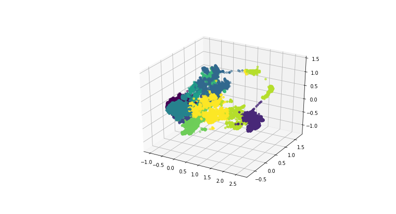

##### k=10 depois da redução de dimensionalidade
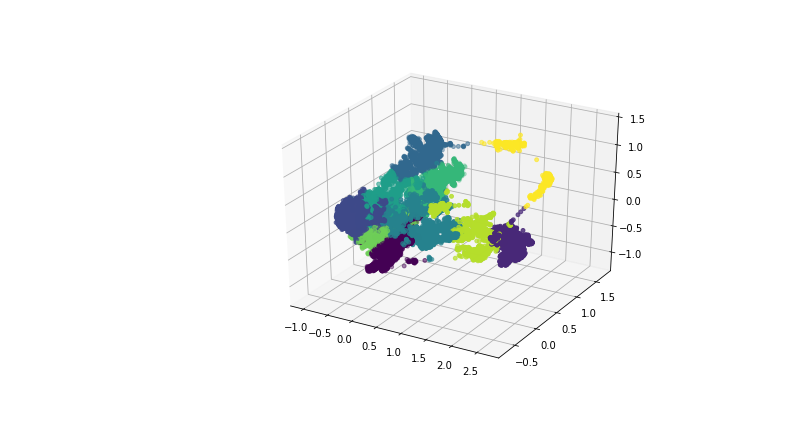

##### k=100 antes da redução de dimensionalidade
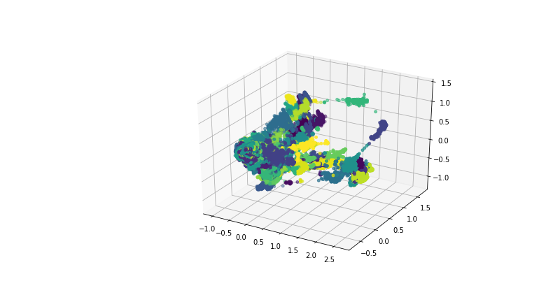

##### k=100 depois da redução de dimensionalidade
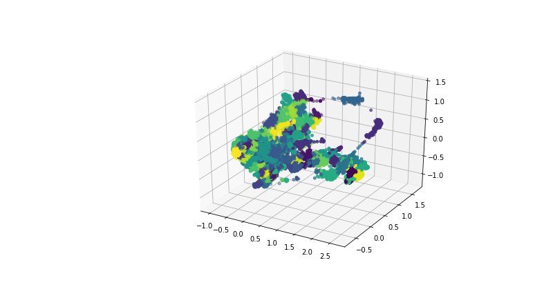

##### k=200 antes da redução de dimensionalidade

##### k=200 depois da redução de dimensionalidade

Para cada conjunto de teste, foi plotado um grafo direcionado onde os nós representam os clusters obtidos nos algoritmos e as arestas simbolizam uma mudança de um cluster para o outro. Por exemplo, na imagem a seguir há uma aresta partindo do nó 10 para o nó 7, o que significa que na sequencia dos dados, houve uma transição do cluster 10 para o cluster 7. Na aresta foi incluído um contador da quantidade que a transição entre os cluster ocorreu, no caso do exemplo, oorreu 1 vez. Os nós vermelhos simbolizam clusters com status de falha. Na pasta [output](output) há um conjunto de arquivos html onde é possível navegar pelos grafos obtidos. 

##### Exemplo de grafo com o resultado de um algoritmo de clusterização. 
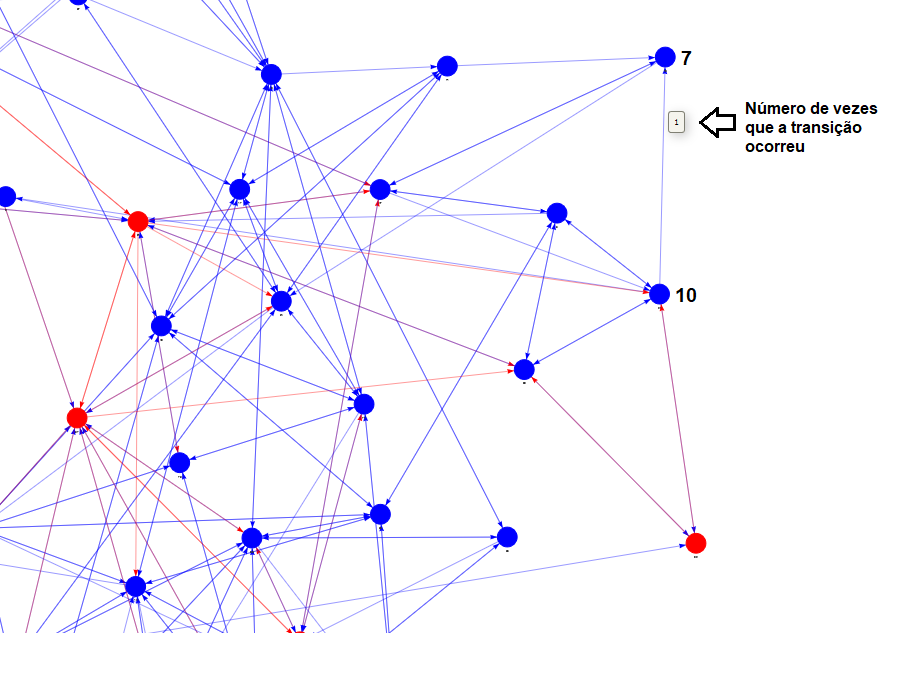

Com o algoritmo K-Means é nítido como a escolha antecipada do parâmetro k é ruim para a abordagem. Com k = 10, os registros de falha não conseguem ser isolados dos registros com funcionamento normal. Com o aumento do número de clusters, o algoritmo consegue isolar os registros de falha, como pode ser visto nas figuras com os grafos nas imagens a seguir. 

##### Grafo K-Means com k=10. [Link](output/grafo-pca-KMeans-10.html)
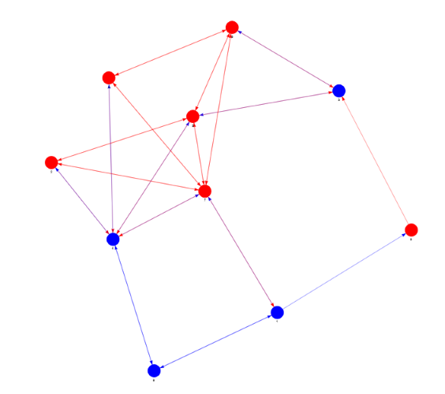

##### Grafo K-Means com k=100. [Link](output/grafo-pca-KMeans-100.html)

##### Grafo K-Means com k=200. [Link](output/grafo-pca-KMeans-200.html)

Mesmo com a dificuldade na escolha de k foi possível identificar a situação buscada neste trabalho com os valores 100 e 200. Estas situações foram destacadas nas imagens a seguir. Com k=100, o cluster 13 precedeu o cluster onde houve falha 32. Isto faz deste cluster um periodo transiente candidato. Com k=200, o cluster de falha 111, foi precedido pelos clusters 13 que por sua vez foi precedido unicamente pelo 188. Os dois tambepm clusters são transientes candidatos e neste segundo caso com potencial de antecipar em até dois clusters a falha. 

##### Análise Grafo K-Means com k=100
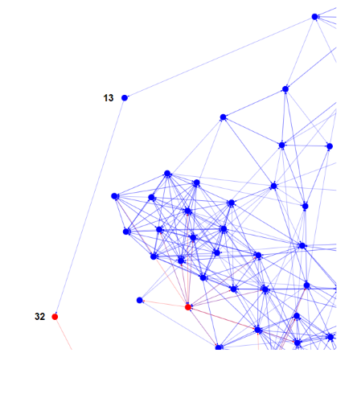

##### Análise Grafo K-Means com k=200
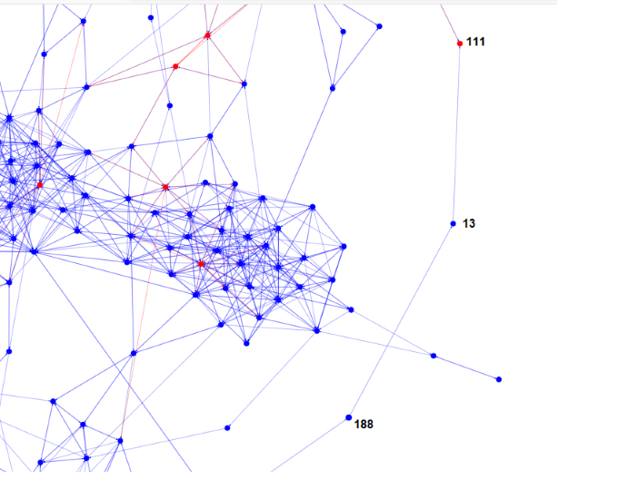

#### Mean Shift

O algoritmo Mean Shift foi escolhido para o teste de um algoritmo que não é necessária a escolha do número de clusters previamente. Foi possível notar que a quantidade de clusters gerados foi bem alta: 60, 794 e 39450 para bandwidth de 0,175, 0,05 e 0,01 respectivamente. A seguir os gráficos dos 3 componentes principais coloridos pelos clusters. 

##### bandwidth=0,175. Número de clusters=60
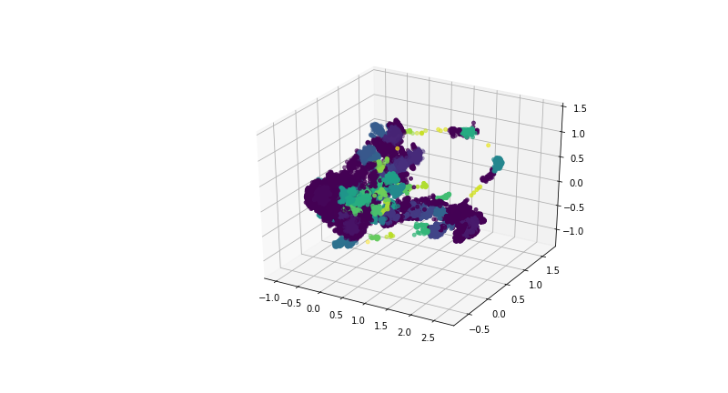

##### bandwidth=0,05. Número de clusters=794 
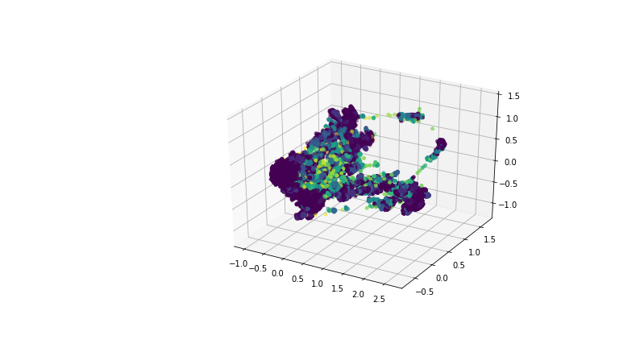

##### bandwidth=0,01. Número de clusters=39450
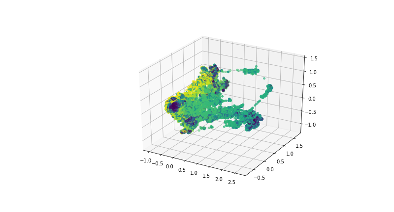

A seguir, os grafos para cada um dos testes realizados. 

##### Grafo Mean Shift bandwidth=0,175. [Link](output/grafo-pca-MeanShift-175.html)
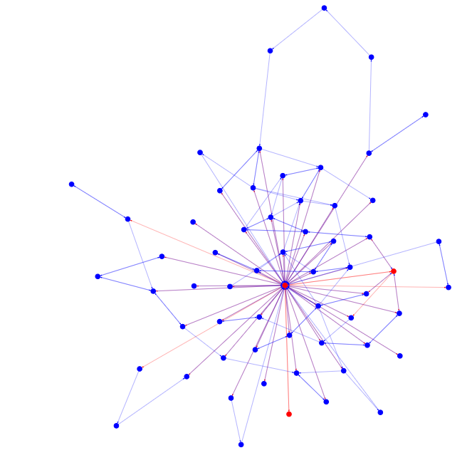

##### Grafo Mean Shift bandwidth=0,05. [Link](output/grafo-pca-MeanShift-05.html)
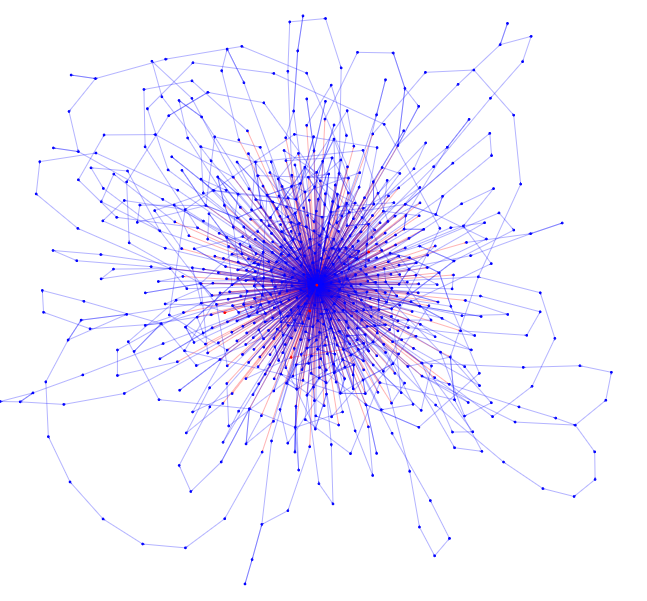

##### Grafo Mean Shift bandwidth=0,01. [Link](output/grafo-pca-MeanShift-01.html)
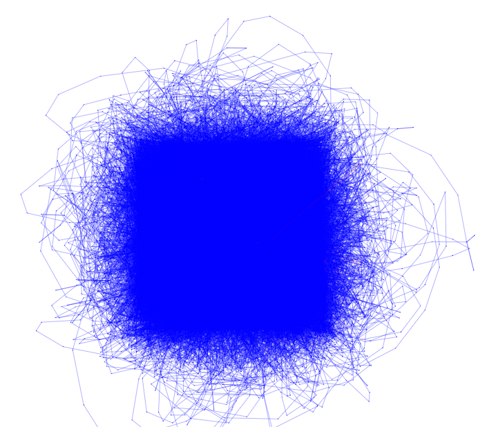

Os grafos com o algoritmo Mean Shift também mostraram caminhos interessantes de transição entre os clusters. Com o parâmetro 0,175 e 60 clusteres gerados, não foi identificado nenhum cluster representativo de período transiente. Com o parãmetro 0,05 e 794 clusters gerados foram identificadas duas situações mostradas nas imagens a seguir. Na situação 1 o cluster transiente candidato 517 precede o nó de falha 414 e na situação 2 o 566 precede o 486. 

##### Análise Grafo Mean Shift bandwidth=0,05. Situação 1 
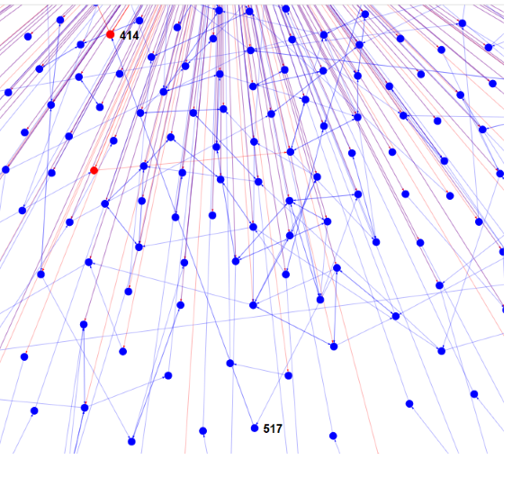

##### Análise Grafo Mean Shift bandwidth=0,05. Situação 2 
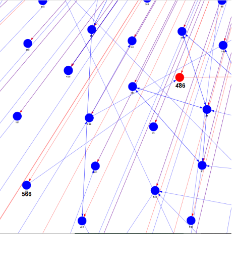

A execução do algoritmo Mean Shift com o parâmetro bandwidth=0,01 gerou 39450 clusters. O grafo gerado é inviável de ser análisado por uma pessoa mas pode conter um nível de detalhe útil para ser analisado por outros algoritmos de machine learning. Poderia ser incluído neste grafo outras informações do processo de manutenção, tais como registros de manutenções realizadas ou comentários das equipes de manutenção sobre as condições do equipamento. O grafo seria a ligação entre uma condição operacional e outras informações sobre o equipamento. 

### 5. Conclusão

Este trabalho mostrou como a algortimos de clusterização podem ser uma ferramenta de apoio no processo de identificação dos períodos transientes nos dados de um equipamento. Embora os resultados da clusterização tenha bastante espaço para melhoria, o processo de obtenção dos clusters e a montagem do grafo de transição entre os estados de operação tem potencial de ajudar o especialista na difícil e cara tarefa de rotular os dados. 

Existem algumas oportunidades de trabalhos futuros dando continuidade a este estudo. A primeira e mais natural é continuar testes com outros algoritmos de clusterização para melhorar o resultado obtido até aqui. Métodos evoltuivos de clusterização poderia ser uma abordagem interessante. Como novas condições de operação podem ocorrer mesmo após muito tempo de operação de um equipamento, este tipo de algoritmo tem potencial de resultados melhores.

O grafo gerado como resultado da clusterização tem poder de representar a transição entre as condições operacionais do equipamento. Esse grafo pode ser utilizado como entrada para outros algortitmos de aprendizado de máquina. Relacionar as condições operacionais de um equipamento com dados de manutenções realizadas, trocas de peças, comentários das equipes de manutenção, estoque de sobressalentes ou qualquer outra informação sobre aquele equipamento tem potencial de ser o ponto de partida para várias outras análises que atualmente parecem extremamente distantes, como, por exemplo, ressuprimento de sobressalentes e abertura de ordens de manutenção automáticas baseadas na condição do equipamento. 

---

Matrícula: 192.671.068

Pontifícia Universidade Católica do Rio de Janeiro

Curso de Pós Graduação *Business Intelligence Master*
